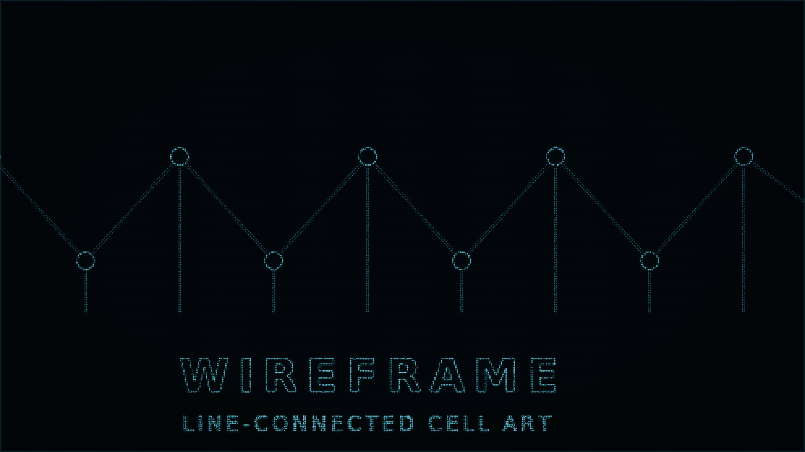
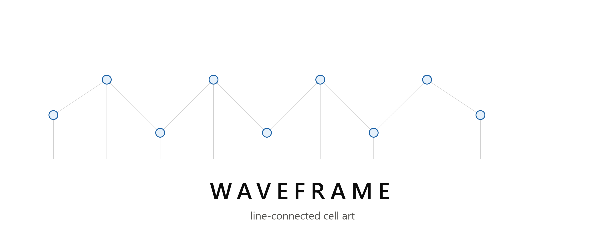

<p align="center">
  
</p>

# WireFrame

> A local-first, browser-native studio for turning images into animated, cursor-reactive ASCII compositions.

No image is ever uploaded. All rendering, processing, and export happens entirely inside your browser.

---

## Getting started

### 1. Clone or download the repository

```bash
git clone https://github.com/saswatsundar123/WireFrame.git
cd WireFrame
```

Or download the ZIP from the GitHub releases page and extract it.

### 2. Install dependencies and run

```bash
# One-time setup: enable the correct pnpm version via corepack
corepack enable

# Install all workspace dependencies
pnpm install

# Start the editor
corepack pnpm dev
```

Open the URL printed in the terminal (typically `http://localhost:5173`), drop a JPG, PNG, or GIF onto the canvas, and start editing in real time.

> **Requirements:** Node.js ≥ 18. `corepack enable` activates the pinned pnpm version automatically — no separate pnpm install needed.

---

## What's inside

### Render modes (10)

Classic ASCII · Braille · Halftone · Dot Cross · Line · Particles · Monochrome · Retro Art · Terminal · Blueprint

### Color palettes (9)

Grayscale · Full Color (sampled) · Matrix Green · Amber Monitor · Cyanotype · Phosphor · Ice White · Palette Gradient · Custom

### Motion & effects

- Five motion presets: None, Drift, Beam Sweep, Noise Field, Cascade
- Five FX modes: None, Glow, Glitch, CRT, Vignette
- Cursor attract / push interaction with radius, strength, and falloff controls

### Image processing

- Floyd–Steinberg, Atkinson, ordered, and disabled dithering
- Local-contrast enhancement, Scharr edge analysis, saliency-weighted sampling
- Resolution 160 → 640, one-click character reduction

### Editor features

- **Undo** — 40-deep history stack, `Ctrl+Z` / `Cmd+Z`
- **Save** — auto-saves config to `localStorage`; manual Save button with visual confirmation
- **Fullscreen** — one-click expand/exit, synced to native browser Fullscreen API
- **Presets** — 8 curated named presets with procedural randomiser
- **Loading indicator** — spinner overlay while images decode
- **Tooltips** — context hints on every interactive control

### Export (3 formats)

- Self-contained interactive HTML file
- React JSX component
- PNG snapshot

---

## Commands

```bash
corepack pnpm dev      # start the editor development server
corepack pnpm build    # production build  →  packages/app/dist/
corepack pnpm test     # run all unit tests (Node built-in test runner)
```

### Benchmark commands

```bash
pnpm benchmark:export     # regenerate the self-contained HTML benchmark export
pnpm benchmark:capture    # capture reference PNGs for all styles
pnpm benchmark:particles  # particles benchmark only
pnpm benchmark:colors     # color-mode comparison
pnpm benchmark:lines      # line-renderer comparison
pnpm benchmark:styles     # all art-style comparison
pnpm benchmark:aspects    # aspect-ratio comparison
pnpm benchmark:generated  # procedural preset benchmark
pnpm benchmark:temporal   # temporal effect benchmark
```

Open `http://localhost:5173/?benchmark=1` for the deterministic benchmark. Append `&style=classic-ascii`, `braille`, `line`, or `particles` to isolate a renderer.

---

## Workspace layout

```
wireframe/
├── packages/
│   ├── core/     — framework-free Canvas engine and image pipeline
│   ├── react/    — lifecycle-safe React canvas wrapper (@wireframe/react)
│   └── app/      — Vite editor, presets, controls, and exporters
├── docs/
│   ├── architecture.md
│   └── performance.md
├── examples/
│   └── benchmarks/   — reference capture PNGs
└── scripts/          — benchmark and export automation
```

See [architecture.md](docs/architecture.md) and [performance.md](docs/performance.md) for implementation details.

---

## Browser support

Current releases of Chrome, Edge, Firefox, and Safari with Canvas 2D, `ResizeObserver`, and `IntersectionObserver` support.

---

## Roadmap — Milestone 2

The next milestone evolves WireFrame from a feature-complete editor into a **procedural rendering engine**.

Goals:

- Unified cell-analysis pipeline shared across all renderers
- Field-based physics simulation with spring, damping, and cursor forces
- Coherent preset generator — Random produces curated visual systems, not shuffled parameters
- Temporal effects: CRT phosphor decay, motion persistence, ghost frames
- Glyph metric cache (coverage, density, entropy, edge response) computed once per font/size
- Structural fidelity benchmark: facial features and edge sharpness preserved at low resolution

The milestone is complete when pressing **RANDOM** consistently produces visually distinct, high-quality outputs — each feeling intentionally designed, not randomly parameterised.

---

## Changelog

### v1.0.0 — Stable Release

**Editor**

- Removed redundant Library, Templates, and Creations navigation buttons
- Added 40-deep undo stack with `Ctrl+Z` / `Cmd+Z` shortcut
- Added auto-save to `localStorage` and manual Save button with visual feedback
- Added fullscreen toggle (EXPAND / EXIT) wired to native browser Fullscreen API
- Added image-load spinner overlay ("PROCESSING") on the canvas during decode
- Added CSS tooltip system across all primary controls
- Removed duplicate SOURCE / PUBLISH buttons; consolidated to sidebar
- Added GitHub icon to SOURCE link in sidebar brand area
- Applied custom favicon and web manifest

**Typography**

- Set JetBrains Mono as the global root font-family across all UI elements
- Fixed wordmark from system sans-serif to JetBrains Mono
- Calibrated font sizes across all UI tiers for readability
- Fixed sidebar metadata label column to prevent text overlap

**Assets & infrastructure**

- Added local JetBrains Mono WOFF2 font files (all 17 weights)
- Added favicon set (ICO, 16×16, 32×32, Apple Touch, Android Chrome, webmanifest)
- Issued MIT License

### v0.1.1

- CI fix: removed `internal_dev/` reference from build path

### v0.1.0

- Initial public release

---

## License

MIT © [Saswat Sundar Rath](https://github.com/saswatsundar123) — see [LICENSE](LICENSE) for full text.

---

<p align="center">
  
</p>
